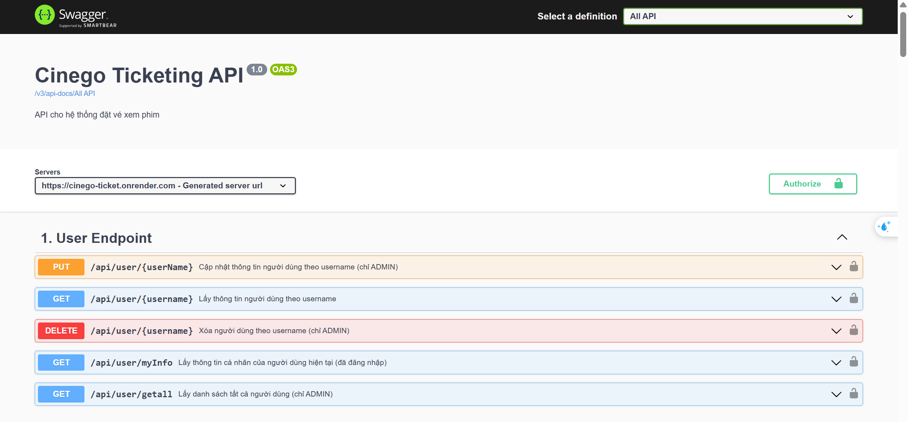
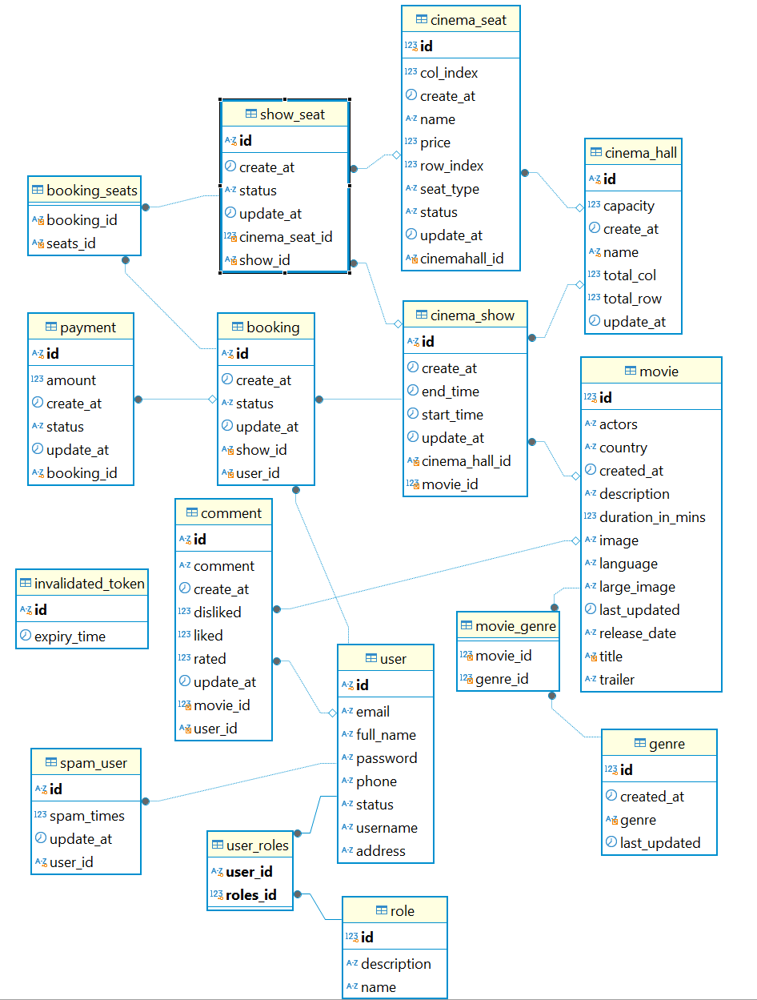

# **. Cinego Ticketing System:**


# **1. Introduction:**
A web-based movie ticket booking system with core features like movie search, seat selection, showtime booking, and (coming soon) online payment.  
This is a personal learning project. I’m responsible for the **Back-end development**.
- Back-end Repository: [cine_be](https://github.com/phamlinh296/cinego_ticket/tree/main/cine_be)  
- Front-end Repository: [cine_fe](https://github.com/phamlinh296/cinego_ticket/tree/main/cine_fe/fe-src)
- Swagger API Docs: [https://cinego-ticket.onrender.com/swagger-ui/index.html](https://cinego-ticket.onrender.com/swagger-ui/index.html)

<p align="center">
  
</p>
<br/>

# **2. Tech Stack:**
- **Backend: Restful API**
	- Java 21, Spring Boot 3.3.4
	- RESTful APIs
	- Spring Security with OAuth2 Resource Server, JWT Authentication
	- Spring Data JPA, Hibernate
	- Redis:
	- `@Cacheable` for caching movie data
	- Redis Pub/Sub for async email notifications
	- Docker, Maven
	- CI/CD: GitHub Actions + Render
- **Frontend:**
	- HTML, CSS, JS
- **Database:**
	- MySQL
<br/><br/>

# **3. System Overview:**
### Front-end Website
http://localhost:80
- Displays movies, showtime information
- Allows seat selection, booking
### Back-end API
http://localhost:9595
- Handles user auth, booking logic, showtime management
- Role-based access control (Admin/User). Provides RESTful APIs
<br/><br/>

# **4. Operating model:**
### &nbsp;&nbsp;&nbsp;&nbsp;&nbsp;**Mô hình Database:**
<div align='center'>
	
</div>
<br/>

# **5. Security & Performance:**
### Authentication & Authorization (Sử dụng JWT - JSON Web Token)
- JWT based using OAuth2 Resource Server
- HS512 algorithm with 32-byte secret key
- JWT payload includes:
  - `scope` – user role (`ADMIN`, `USER`)
  - `sub` – username
  - `iat`, `exp` – issue & expiry timestamps
  - `jti` – token ID
### Caching & Asynchronous Processing
- `@Cacheable` – caches movie queries to reduce DB load
- Redis Pub/Sub – sends confirmation emails asynchronously after successful booking
<br/>

# **6. Key Features:**
### **A. For Users:**
- Register, Login, Logout
- Search movies by name, genre
- Book tickets:
  - Select showtime (date, time, room)
  - Choose seats
  - Payment with VNPAY

### **B. For Admin:**
- Manage users (blacklist/spam control)
- Manage movies, schedules, rooms, seat layout
- Automatically cancel expired "Pending" bookings
<br/><br/>

# **7. Unit Testing**
Implemented using JUnit 5 and Mockito
Run tests with:
```bash
./mvnw test
```

# **8. CI/CD**
- GitHub Actions: runs tests + auto-deploys on main push
- Render: hosts back-end with automatic deploys
<br/><br/>

# **9. How to Run This Project:**
a. Prerequisites
- Java 21
- Docker
- MySQL
- Redis

b. Run with Docker (recommended)
```bash
git clone https://github.com/phamlinh296/cinego_ticket.git
cd cinego_ticket
cp .env.example .env   # Set up DB & Redis config
docker-compose up
```
c. Manual Run:
Set your environment variables and run:
```bash
./mvnw spring-boot:run
```
<br/><br/>
Contact
📧 Email: phamylinh.kc@gmail.com
🐙 GitHub: phamlinh296


