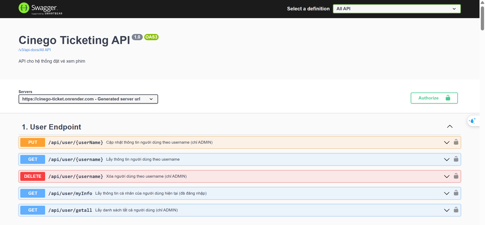
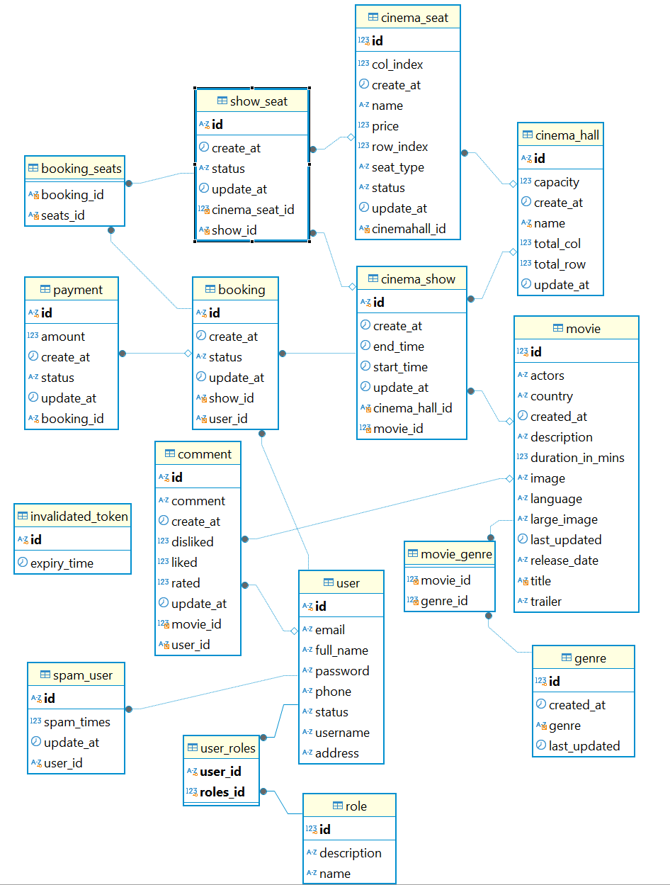

# Cinego Ticketing System


Hệ thống đặt vé xem phim trực tuyến theo kiến trúc **event-driven**, tích hợp **phát hiện gian lận realtime** và **phân tích doanh thu** bằng Apache Spark Streaming.

Swagger API: [https://cinego-ticket.onrender.com/swagger-ui/index.html](https://cinego-ticket.onrender.com/swagger-ui/index.html)

<p align="center">
  
</p>

---

## 1. Tech Stack

| Layer | Công nghệ |
|---|---|
| Backend API | Java 21, Spring Boot 3.3.4 |
| Auth | Spring Security, OAuth2 Resource Server, JWT (HS512) |
| Database | MySQL (JPA/Hibernate) |
| Cache | Redis — `@Cacheable` cho movie data, Pub/Sub cho email async |
| Message broker | Apache Kafka 3.7 (KRaft mode, 3 partitions) |
| Stream processing | Apache Spark 3.5.1 Structured Streaming |
| Big data storage | Apache HBase (lưu lịch sử thanh toán, fraud logs) |
| Frontend | HTML/CSS/JS (user), Nginx (admin) |
| DevOps | Docker Compose, GitHub Actions, Render |

---

## 2. Kiến trúc hệ thống

```
Browser (cine-fe :5500 / admin :80)
           │
           ▼
  Spring Boot API (:9595)
    ├── JWT Auth
    ├── JPA → MySQL
    ├── Redis cache / Pub/Sub
    └── Kafka Producer ──────────────────────────────────┐
                                                         │
                                              topic: payment-events
                                                         │
                                    ┌────────────────────┴──────────────────────┐
                                    ▼                                           ▼
                         FraudDetectionJob                              AnalyticsJob
                         (Spark Streaming)                            (Spark Streaming)
                         consumer: fraud-detection-group              consumer: analytics-group
                                    │                                           │
                    ┌───────────────┼───────────────┐              ┌───────────┴────────────┐
                    ▼               ▼               ▼              ▼                        ▼
             Kafka topic        HBase              Redis         Redis                    HBase
           anomaly-events     fraud_logs       fraud_count   top_movies              analytics_daily
                              payment_history               user_stats
                                                            revenue
```

**Luồng hoạt động khi user thanh toán:**
1. User bấm thanh toán → Spring Boot tạo `PaymentEvent` → publish lên Kafka topic `payment-events`
2. Kafka fan-out đến 2 consumer group độc lập (fraud + analytics) — không ảnh hưởng nhau
3. **FraudDetectionJob** phân tích từng batch → nếu phát hiện gian lận → ghi vào `anomaly-events` + HBase + Redis
4. **AnalyticsJob** tổng hợp doanh thu, xếp hạng phim, thống kê user → ghi vào Redis để dashboard đọc realtime

---

## 3. Spark Processor — Phát hiện gian lận & Analytics

Module `spark-processor` chạy 2 Spark Structured Streaming job độc lập, cùng đọc từ Kafka topic `payment-events`.

### 3.1 FraudDetectionJob

**Mục tiêu:** Phát hiện giao dịch bất thường trong thời gian thực.

**Cách hoạt động:**
- Đọc Kafka từ `startingOffsets: earliest` (không bỏ sót event khi restart)
- Áp dụng **watermark 10 phút** để xử lý event đến trễ
- Group by `userId`, **sliding window 1 giờ / slide 5 phút**, trigger mỗi 30 giây
- Mỗi micro-batch chạy 2 bộ phát hiện song song:

**Bộ phát hiện 1 — Pattern (PatternDetector):**

| Pattern | Điều kiện | Risk Score |
|---|---|---|
| **SMURFING** | ≥3 giao dịch nhỏ (≤200K) + ≥1 giao dịch lớn (≥1M) + max(lớn) ≥ 10× avg(nhỏ) | 0.7 + (số tx nhỏ × 0.05), tối đa 0.99 |
| **HIGH_FREQUENCY_WINDOW** | ≥10 giao dịch trong vòng 1 giờ | 0.75 |

> Smurfing là thủ thuật chia nhỏ giao dịch lớn thành nhiều giao dịch nhỏ để tránh bị phát hiện, sau đó thực hiện 1 giao dịch lớn bất thường.

**Bộ phát hiện 2 — Z-Score sâu (ZScoreWindowCalculator):**
- Lấy **500 records lịch sử** của user từ HBase (≈ 30 ngày)
- Tính Z = (amount − mean) / std
- Nếu |Z| > 3.0 → giao dịch bất thường thống kê → `ZSCORE_DEEP` alert

> Khác với Spring Boot (dùng Redis, 20 records gần nhất, phản hồi nhanh): Spark dùng HBase với 500 records cho độ chính xác cao hơn nhiều.

**Output khi phát hiện fraud:**

| Nơi ghi | Nội dung |
|---|---|
| Kafka `anomaly-events` | FraudAlert JSON để downstream consumer xử lý tiếp |
| HBase `fraud_logs` | Row key: `{userId}_{alertType}_{reverseTimestamp}` — scan theo user, sort mới nhất trước |
| HBase `payment_history` | Lưu lịch sử để ZScoreCalculator đọc lại cho batch sau |
| Redis `spark:fraud_count:{date}` | Counter fraud trong ngày, hiển thị trên dashboard |

---

### 3.2 AnalyticsJob

**Mục tiêu:** Tổng hợp doanh thu, xếp hạng phim, thống kê hành vi user — phục vụ dashboard realtime.

**Cách hoạt động:**
- Đọc Kafka từ `startingOffsets: latest` (chỉ đọc event mới từ khi job start)
- Chạy **3 StreamingQuery song song** — không thể merge vì mỗi query cần output mode khác nhau:

| Query | Window | Output mode | Trigger | Kết quả |
|---|---|---|---|---|
| **Revenue** | Sliding 1h / slide 5min | update | 30s | Doanh thu theo giờ |
| **Top Movies** | Tumbling 1h | complete | 30s | Bảng xếp hạng phim |
| **User Stats** | Sliding 1h / slide 15min | update | 30s | Thống kê giao dịch theo user |

**Output ghi vào Redis và HBase:**

| Redis key | Kiểu | Nội dung | TTL |
|---|---|---|---|
| `spark:revenue:{date}:{hour}` | String (số thực) | Tổng doanh thu theo giờ | 48h |
| `spark:top_movies:{date}` | Sorted Set | MovieId → tổng doanh thu, ZREVRANGE lấy top 10 | 48h |
| `spark:user_stats:{userId}` | Hash | `tx_count`, `total_amount`, `avg_amount` | 7 ngày |

| HBase table | Row key | Nội dung |
|---|---|---|
| `analytics_daily` | `{date}_{movieId}` | `tx_count`, `revenue` — Increment atomic, safe khi nhiều executor |

---

### 3.3 Tại sao dùng 2 job riêng biệt?

- **Consumer group khác nhau** (`fraud-detection-group` vs `analytics-group`) → Kafka fan-out, cả 2 đều nhận đủ toàn bộ event, không tranh nhau offset
- **Output mode khác nhau** → FraudDetection cần `append` (chỉ emit alert mới); Analytics Revenue cần `update`; Top Movies cần `complete` (emit toàn bộ leaderboard) — không thể mix trong 1 job
- **Scale độc lập** → có thể tăng executor cho fraud mà không ảnh hưởng analytics

---

## 4. Database Schema

<div align='center'>
  
</div>

---

## 5. Security

- **JWT (HS512):** Payload gồm `scope` (ADMIN/USER), `sub`, `iat`, `exp`, `jti`
- **XSS protection:** OWASP Encoder + JSoup cho mọi input từ user
- **Redis Pub/Sub:** Email xác nhận đặt vé gửi bất đồng bộ, không block API response

---

## 6. Tính năng chính

**User:**
- Đăng ký / Đăng nhập (JWT + OAuth2)
- Tìm kiếm phim theo tên, thể loại
- Chọn suất chiếu, chọn ghế, thanh toán qua VNPAY

**Admin:**
- Quản lý phim, lịch chiếu, phòng, sơ đồ ghế
- Quản lý người dùng (blacklist)
- Tự động hủy booking "Pending" hết hạn

---

## 7. Cách chạy dự án

Xem hướng dẫn chi tiết trong thư mục `cine-be/`:
- **Lần đầu tải về:** `cine-be/FIRST-TEST-GUIDE.md`
- **Restart lại sau lần đầu:** `cine-be/COMPLETE-TEST-GUIDE.md`

Tóm tắt nhanh:

```bash
# 1. Khởi động infrastructure
cd cine-be && docker compose up -d

# 2. Chạy backend (terminal riêng, đứng ở root)
./mvnw spring-boot:run -pl cine-be

# 3. Chạy FraudDetectionJob (terminal riêng)
docker exec spark-master /opt/spark/bin/spark-submit --deploy-mode client --master spark://spark-master:7077 --class linh.vn.spark.job.FraudDetectionJob /opt/spark-jobs/spark-processor-0.0.1-SNAPSHOT-shaded.jar kafka:9092 hbase 2181 redis 6379

# 4. Chạy AnalyticsJob (terminal riêng)
docker exec spark-master /opt/spark/bin/spark-submit --deploy-mode client --master spark://spark-master:7077 --class linh.vn.spark.job.AnalyticsJob /opt/spark-jobs/spark-processor-0.0.1-SNAPSHOT-shaded.jar kafka:9092 hbase 2181 redis 6379

# 5. Gửi test event
curl http://localhost:9595/api/payment/test-kafka
```

**UI sau khi chạy:**
- API: `http://localhost:9595/swagger-ui/index.html`
- Spark: `http://localhost:8080`
- HBase: `http://localhost:16010`

---

## 8. CI/CD

- **GitHub Actions:** Chạy test tự động khi push lên `main`
- **Render:** Auto-deploy backend sau khi CI pass

---

📧 phamylinh.kc@gmail.com · 🐙 [phamlinh296](https://github.com/phamlinh296)
